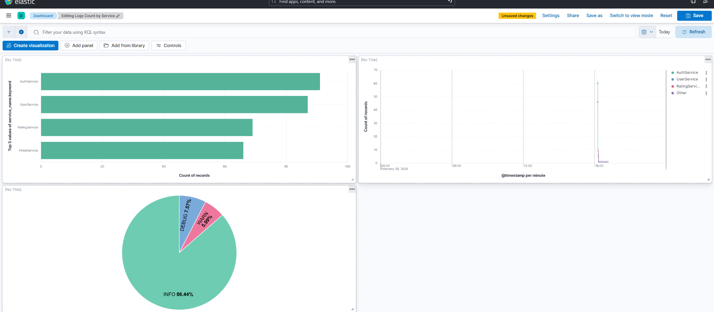

# Microservices Architecture Project

A production-ready microservices architecture demonstrating industry-standard patterns, security, resilience, and observability.

## 🚀 Quick Start

### Prerequisites
- Docker & Docker Compose installed
- Copy `.env.example` to `.env` and configure your secrets

### Option 1: Docker Deployment (Recommended)

```bash
# 1. Setup environment variables
cp .env.example .env
# Edit .env and set secure passwords and JWT secret

# 2. Deploy entire stack
docker-compose up -d --build

# 3. Wait 2-3 minutes, then access:
# - Eureka: http://localhost:8761 (username: admin, password: from .env)
# - API Gateway: http://localhost:8084
```

**Important**: See [docs/SECURITY_SETUP.md](docs/SECURITY_SETUP.md) for detailed security configuration.

**Note**: For ELK Stack setup, see [docs/ELK_SETUP_GUIDE.md](docs/ELK_SETUP_GUIDE.md)

See [docs/DOCKER_QUICK_START.md](docs/DOCKER_QUICK_START.md) for details.

### Option 2: Local Development

```bash
# 1. Set environment variables (see SECURITY_SETUP.md)
# Windows PowerShell:
$env:AUTH_DB_PASSWORD="your_password"
$env:JWT_SECRET="your_secret_key"
# ... (see SECURITY_SETUP.md for complete list)

# 2. Start each service manually
cd ServiceRegistry && mvn spring-boot:run
cd AuthService && mvn spring-boot:run
cd UserService && mvn spring-boot:run
cd HotelService && mvn spring-boot:run
cd RatingService && mvn spring-boot:run
cd ApiGateway && mvn spring-boot:run
```

See [docs/SECURITY_SETUP.md](docs/SECURITY_SETUP.md) and [docs/QUICK_START_GUIDE.md](docs/QUICK_START_GUIDE.md) for details.

## 📸 Screenshots

### Kibana Dashboard - Centralized Logging


*Real-time log visualization with Elasticsearch, Logstash, and Kibana showing logs from all microservices*

## 📚 Documentation

All documentation is organized in the [`docs/`](docs/) folder.

### Getting Started
- 📖 [Project Summary](docs/PROJECT_SUMMARY.md) - Complete overview
- 🔐 [Security Setup](docs/SECURITY_SETUP.md) - Security configuration guide
- 🚀 [Docker Quick Start](docs/DOCKER_QUICK_START.md) - Deploy with Docker
- 🔧 [Quick Start Guide](docs/QUICK_START_GUIDE.md) - Local development
- 📑 [Documentation Index](docs/DOCUMENTATION_INDEX.md) - All docs navigation

### Features & Technologies
- ⭐ [Technologies Summary](docs/TECHNOLOGIES_SUMMARY.md) - Quick reference
- 📋 [Features Implemented](docs/PROJECT_FEATURES_IMPLEMENTED.md) - Complete feature list
- 🎯 [What I Built](docs/WHAT_I_BUILT.md) - Visual summary

### Architecture & Design
- 🏗️ [Architecture Overview](docs/ARCHITECTURE_OVERVIEW.md) - System design
- 📋 [API Documentation](docs/API_DOCUMENTATION.md) - Complete API reference
- 🎤 [Presentation Script](docs/PRESENTATION_SCRIPT.md) - How to present

### Deployment & Operations
- 🐳 [Docker Deployment Guide](docs/DOCKER_DEPLOYMENT_GUIDE.md) - Complete Docker guide
- 📊 [Deployment Comparison](docs/DEPLOYMENT_COMPARISON.md) - Local vs Docker
- 📊 [ELK Setup Guide](docs/ELK_SETUP_GUIDE.md) - Centralized logging
- ⚠️ [Exception Handling](docs/EXCEPTION_HANDLING_SUMMARY.md) - Error handling
- 🎯 [JMeter Testing Guide](docs/JMETER_TESTING_GUIDE.md) - Performance & load testing

### Testing
- 📮 [Postman Collection](Microservices_Postman_Collection.json) - Import into Postman
- 🧪 Test Scripts - PowerShell scripts in guides
- 📊 JMeter Test Plans - Performance testing

## 🎯 Features

### Core Features
✅ 6 independent microservices
✅ Service discovery with Eureka
✅ API Gateway with routing
✅ JWT authentication
✅ Database per service pattern
✅ RESTful APIs

### Security
✅ JWT-based authentication
✅ BCrypt password hashing
✅ Token validation at gateway
✅ Role-based access control
✅ Environment-based secrets management
✅ Eureka dashboard authentication
✅ Rate limiting on auth endpoints
✅ Network isolation for internal services

### Resilience
✅ Circuit Breaker pattern
✅ Retry pattern
✅ Rate Limiter pattern
✅ Fallback mechanisms

### Observability
✅ Centralized logging (ELK Stack)
✅ Structured JSON logs
✅ Request/Response logging
✅ Kibana dashboards

## 🏗️ Architecture

```
Client → API Gateway → [AuthService, UserService, HotelService, RatingService]
                              ↓
                        Service Registry (Eureka)
                              ↓
                        [MySQL, PostgreSQL]
                              ↓
                        ELK Stack (Logs)
```

## 🛠️ Technology Stack

- **Framework**: Spring Boot 3.2.5, Spring Cloud 2023.0.1
- **Security**: Spring Security, JWT, BCrypt
- **Resilience**: Resilience4j
- **Databases**: MySQL, PostgreSQL
- **Service Discovery**: Netflix Eureka
- **API Gateway**: Spring Cloud Gateway
- **Logging**: ELK Stack (Elasticsearch, Logstash, Kibana)
- **Containerization**: Docker, Docker Compose

## 📊 Services

| Service | Port | Purpose |
|---------|------|---------|
| Service Registry | 8761 | Service discovery (Eureka) |
| API Gateway | 8084 | Entry point, routing, auth |
| AuthService | 8086 | Authentication & JWT |
| UserService | 8081 | User management |
| HotelService | 8082 | Hotel management |
| RatingService | 8083 | Rating management |

## 🧪 Testing

### Using Postman
1. Import `Microservices_Postman_Collection.json`
2. Run "Complete Flow Test" folder
3. All tests execute automatically

### Using PowerShell
```powershell
# Register user
$body = @{
    username = "test_user"
    password = "password123"
    email = "test@example.com"
    name = "Test User"
    about = "Testing"
} | ConvertTo-Json

$response = Invoke-RestMethod -Uri "http://localhost:8086/auth/register" -Method POST -ContentType "application/json" -Body $body

$token = $response.token
$userId = $response.userId
```

## 🔒 Security

This project implements production-ready security practices:

- **Environment Variables**: All secrets managed via environment variables
- **JWT Authentication**: 15-minute token expiry with secure secret management
- **Rate Limiting**: Protection against brute-force attacks (5 attempts/minute)
- **Network Isolation**: Internal services not exposed to host network
- **Eureka Security**: Dashboard protected with basic authentication
- **Password Encryption**: BCrypt hashing with salt

See [docs/SECURITY_SETUP.md](docs/SECURITY_SETUP.md) for complete security documentation.

---

## 🐳 Docker Commands

**Important**: Ensure `.env` file is configured before running Docker commands.

```bash
# Setup environment
cp .env.example .env
# Edit .env with your secure values

# Start all services
docker-compose up -d --build

# View logs
docker-compose logs -f

# Stop all services
docker-compose down

# Clean start (removes data)
docker-compose down -v && docker-compose up -d --build
```

## 📈 Monitoring

- **Eureka Dashboard**: http://localhost:8761
- **Kibana (Logs)**: http://localhost:5601
- **API Gateway**: http://localhost:8084

## 🔧 Development

### Prerequisites
- Java 17+
- Maven 3.8+
- Docker & Docker Compose (for containerized deployment)
- MySQL 8.0+ (for local development)
- PostgreSQL 14+ (for local development)

### Build
```bash
# Build all services
mvn clean install

# Build specific service
cd UserService && mvn clean install
```

### Run Tests
```bash
# Run tests
mvn test

# Run with coverage
mvn test jacoco:report
```

## 📝 API Endpoints

### Authentication
```
POST /auth/register - Register new user
POST /auth/login    - Login user
POST /auth/validate - Validate token
```

### User Management
```
GET  /users/{userId} - Get user with ratings & hotels
GET  /users          - Get all users
POST /users          - Create user
```

### Hotel Management
```
GET    /hotels/{hotelId} - Get hotel
GET    /hotels           - Get all hotels
POST   /hotels           - Create hotel
PUT    /hotels/{hotelId} - Update hotel
DELETE /hotels/{hotelId} - Delete hotel
```

### Rating Management
```
GET    /ratings/{ratingId}        - Get rating
GET    /ratings/users/{userId}    - Get user ratings
GET    /ratings/hotels/{hotelId}  - Get hotel ratings
POST   /ratings                   - Create rating
PUT    /ratings/{ratingId}        - Update rating
DELETE /ratings/{ratingId}        - Delete rating
```

## 🎓 Learning Outcomes

This project demonstrates:
- Microservices architecture design
- Service discovery and registration
- API Gateway pattern
- JWT authentication and security
- Circuit breaker and resilience patterns
- Database per service pattern
- Inter-service communication
- Centralized logging and monitoring
- Docker containerization
- RESTful API design

## 🤝 Contributing

Contributions are welcome! Please:
1. Fork the repository
2. Create a feature branch
3. Make your changes
4. Submit a pull request

## 📄 License

This project is open source and available under the MIT License.

## 👤 Author

Vivek Bhosale

## 🙏 Acknowledgments

- Spring Boot & Spring Cloud teams
- Netflix OSS (Eureka)
- Resilience4j team
- Elastic (ELK Stack)

## 📞 Support

For questions or issues:
1. Check the documentation in the `docs/` folder
2. Review the troubleshooting section in guides
3. Check service logs: `docker-compose logs -f`

## 🗺️ Roadmap

- [ ] Add Swagger/OpenAPI documentation
- [ ] Implement distributed tracing (Zipkin)
- [ ] Add metrics (Prometheus + Grafana)
- [ ] Implement caching (Redis)
- [ ] Add message queue (Kafka)
- [ ] Create Kubernetes manifests
- [ ] Add integration tests
- [ ] Implement CI/CD pipeline

---

**Ready to start?** → See [docs/DOCKER_QUICK_START.md](docs/DOCKER_QUICK_START.md) or [docs/QUICK_START_GUIDE.md](docs/QUICK_START_GUIDE.md)
